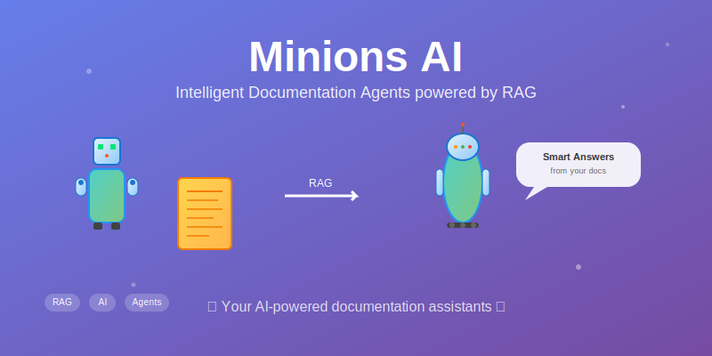

# Minions AI 🤖📚

**An intelligent agentic AI system that helps developers navigate, understand, and work with documentation using Retrieval-Augmented Generation (RAG)**

## 🚧 Project Status

> **⚠️ UNDER DEVELOPMENT** - This project is currently in early development phase. The features and capabilities described below represent our vision and roadmap, not current functionality.

**Current Status**: Early planning and architecture design  
**Expected MVP**: Q2 2024  
**Looking for**: Contributors, feedback, and early adopters

## Vision & Overview

Minions AI will be a specialized crew of AI agents designed to revolutionize how developers interact with documentation. When complete, the system will handle complex API references, SDK manuals, framework documentation, and technical specifications, with our intelligent agents acting as personal documentation assistants.

## Planned Features

### 🎯 **Developer-Focused Intelligence** *(In Development)*
Our agents will be specifically trained to understand developer workflows, technical terminology, and the context in which documentation is consumed. They won't just search—they'll comprehend, contextualize, and deliver precise answers.

### 🔍 **Advanced RAG Technology** *(Planned)*
Using state-of-the-art Retrieval-Augmented Generation, Minions AI will:
- Index and semantically understand your documentation
- Retrieve relevant information with high precision
- Generate contextual, accurate responses
- Maintain source attribution for reliability

### 🚀 **Multi-Modal Documentation Support** *(Roadmap)*
- **API Documentation**: REST APIs, GraphQL schemas, OpenAPI specs
- **SDK Manuals**: Language-specific libraries and frameworks
- **Technical Guides**: Setup instructions, tutorials, best practices
- **Code Examples**: Inline documentation, README files, code comments
- **Architecture Docs**: System designs, data flows, integration guides

## Planned Key Features

### 🤝 **Intelligent Query Processing** *(Future Development)*
- Natural language questions about complex technical concepts
- Code-specific queries with syntax and usage examples
- Troubleshooting assistance with error resolution
- Best practice recommendations based on documentation

### 📖 **Context-Aware Responses** *(Future Development)*
- Understands your current project context
- Provides relevant examples and use cases
- Suggests related documentation sections
- Maintains conversation history for follow-up questions

### 🔗 **Source Integration** *(Future Development)*
- Direct links to original documentation
- Version-aware responses for different software releases
- Cross-reference capabilities between related documents
- Real-time updates when documentation changes

### ⚡ **Developer Workflow Integration** *(Future Development)*
- IDE plugin support for in-context help
- CLI tools for terminal-based queries
- API endpoints for custom integrations
- Webhook support for documentation updates

## Planned Use Cases

> **Note**: These are examples of what the system will be able to do once fully developed.

### For Individual Developers *(Future)*
- **Quick Reference**: "How do I authenticate with the Stripe API using Node.js?"
- **Troubleshooting**: "Why am I getting a 401 error with my OAuth implementation?"
- **Learning**: "Show me examples of React Hook patterns from the official docs"
- **Discovery**: "What are the new features in Python 3.12 that affect async programming?"

### For Development Teams *(Future)*
- **Onboarding**: Help new team members understand internal APIs and frameworks
- **Code Reviews**: Verify implementations against best practices from documentation
- **Architecture Decisions**: Compare different approaches documented across multiple sources
- **Migration Guides**: Navigate breaking changes and upgrade paths

### For Technical Writers *(Future)*
- **Content Validation**: Ensure documentation completeness and accuracy
- **Gap Analysis**: Identify missing or outdated documentation sections
- **User Experience**: Understand how developers actually use documentation
- **Content Optimization**: Improve discoverability and clarity based on query patterns

## How It Will Work *(Planned Architecture)*

1. **Document Ingestion**: Minions AI will process your documentation sources, creating semantic embeddings and knowledge graphs
2. **Query Understanding**: Natural language processing will interpret developer intent and technical context
3. **Intelligent Retrieval**: RAG technology will find the most relevant information across all indexed sources
4. **Response Generation**: AI agents will craft comprehensive, accurate answers with proper attribution
5. **Continuous Learning**: The system will improve based on user feedback and usage patterns

## Planned Architecture

```
┌─────────────────┐    ┌──────────────────┐    ┌─────────────────┐
│   User Query    │───▶│  Agent Router    │───▶│  Specialist     │
│   (Natural      │    │  (Intent         │    │  Agents         │
│   Language)     │    │  Classification) │    │  (API, SDK,     │
└─────────────────┘    └──────────────────┘    │  Framework)     │
                                               └─────────────────┘
                              │                          │
                              ▼                          ▼
┌─────────────────┐    ┌──────────────────┐    ┌─────────────────┐
│   Response      │◀───│  RAG Engine      │◀───│  Vector Store   │
│   Generation    │    │  (Retrieval +    │    │  (Semantic      │
│   (Contextual   │    │  Generation)     │    │  Embeddings)    │
│   Answers)      │    └──────────────────┘    └─────────────────┘
└─────────────────┘
```

## Getting Started *(Not Yet Available)*

### Installation *(Coming Soon)*
```bash
# Installation will be available once the first release is ready
pip install minions-ai
```

### Basic Usage *(Coming Soon)*
```python
# Usage examples will be provided as the implementation progresses
from minions_ai import DocumentationAgent

agent = DocumentationAgent()
response = agent.query("How do I implement OAuth2 in FastAPI?")
print(response.answer)
print(f"Source: {response.source_url}")
```

## 🗺️ Development Roadmap

### Phase 1: Foundation *(Current Focus)*
- [ ] **Project Setup & Architecture**
  - [ ] Define core agent architecture and interfaces
  - [ ] Set up development environment and CI/CD
  - [ ] Create basic project structure and documentation
  - [ ] Research and select core technologies (LLM providers, vector stores, etc.)

- [ ] **Core RAG Engine** *(In Progress)*
  - [ ] Document ingestion pipeline
  - [ ] Vector embeddings and semantic search
  - [ ] Basic retrieval mechanisms
  - [ ] Response generation with source attribution

### Phase 2: MVP Development *(Q2 2024)*
- [ ] **Basic Agent System**
  - [ ] Single documentation agent implementation
  - [ ] Simple query processing and response generation
  - [ ] Basic web interface for testing
  - [ ] Support for markdown and common documentation formats

- [ ] **CLI Interface**
  - [ ] Command-line tool for document indexing
  - [ ] Interactive query interface
  - [ ] Configuration management
  - [ ] Basic help and documentation

### Phase 3: Specialized Agents *(Q3 2024)*
- [ ] **API Documentation Agent**
  - [ ] OpenAPI/Swagger specification parsing
  - [ ] REST API endpoint understanding
  - [ ] Code example generation
  - [ ] Authentication and error handling guidance

- [ ] **SDK Manual Specialist Agent**
  - [ ] Language-specific documentation parsing
  - [ ] Code example extraction and understanding
  - [ ] Version-specific feature mapping
  - [ ] Installation and setup guidance

- [ ] **Framework Documentation Agent**
  - [ ] Framework-specific pattern recognition
  - [ ] Best practices extraction
  - [ ] Migration guide processing
  - [ ] Component and concept relationship mapping

### Phase 4: Advanced Features *(Q4 2024)*
- [ ] **Enhanced Query Types**
  - [ ] Code generation assistance
  - [ ] Debugging and troubleshooting help
  - [ ] Multi-step tutorial generation
  - [ ] Comparative analysis between options

- [ ] **Web Interface**
  - [ ] Modern web application
  - [ ] Document upload and management
  - [ ] Query history and bookmarks
  - [ ] Team collaboration features

### Phase 5: Integrations *(Q1 2025)*
- [ ] **IDE Integrations**
  - [ ] VS Code extension
  - [ ] JetBrains plugin
  - [ ] Vim/Neovim integration
  - [ ] Context-aware help within editors

- [ ] **Advanced Features**
  - [ ] Multi-language support
  - [ ] Real-time documentation updates
  - [ ] Analytics and usage insights
  - [ ] Custom agent training

### Phase 6: Enterprise & Scale *(Q2 2025)*
- [ ] **Enterprise Features**
  - [ ] Team collaboration and sharing
  - [ ] Private documentation hosting
  - [ ] Role-based access control
  - [ ] Enterprise integrations (Confluence, Notion, etc.)

- [ ] **Performance & Scale**
  - [ ] Horizontal scaling capabilities
  - [ ] Advanced caching strategies
  - [ ] Performance monitoring and optimization
  - [ ] SLA and reliability improvements

## 🏃‍♂️ Quick Start for Contributors

Since this is an early-stage project, we're looking for contributors to help build the foundation:

### Current Priorities
1. **Architecture Design**: Help define the core agent system architecture
2. **RAG Implementation**: Build the retrieval-augmented generation pipeline
3. **Documentation**: Create comprehensive development documentation
4. **Testing**: Establish testing frameworks and methodologies
5. **UI/UX Design**: Design the user interface and experience

### How to Get Involved
1. Check out the [Issues](https://github.com/alifa98/minions-ai/issues) tab for current tasks
2. Join our discussions for architecture and design decisions
3. Fork the repository and submit pull requests
4. Help us define requirements and specifications

## 🤝 Contributing

We're in the early stages of development and actively seeking contributors! This is a great opportunity to help shape the project from the ground up.

### What We Need Help With

**🏗️ Core Development**
- RAG engine implementation using modern frameworks
- Agent architecture and communication patterns
- Document processing and indexing pipelines
- Vector database integration and optimization

**🎨 User Experience**
- CLI interface design and implementation
- Web interface mockups and development
- IDE plugin architecture and development
- User workflow optimization

**📋 Project Management**
- Requirements gathering and specification
- Testing strategy and implementation
- Documentation and technical writing
- Community building and outreach

### Getting Started as a Contributor

1. **Explore the codebase**: Fork the repository and familiarize yourself with the current structure
2. **Check the issues**: Look for issues labeled `good first issue` or `help wanted`
3. **Join discussions**: Participate in architecture and design discussions
4. **Propose features**: Open issues for new features or improvements
5. **Submit PRs**: Start with small improvements and work up to larger features

### Development Setup *(Coming Soon)*

Detailed development setup instructions will be added as the core architecture is established.

For now, contributors can help with:
- Architecture design and documentation
- Requirements specification
- Research on RAG technologies and best practices
- UI/UX mockups and design

## License

This project is licensed under the MIT License - see the [LICENSE](LICENSE) file for details.

## 📞 Contact & Support

**Current Project Phase**: Early Development - Architecture & Planning

- **Issues**: Report ideas, suggestions, and early feedback via [GitHub Issues](https://github.com/alifa98/minions-ai/issues)
- **Discussions**: Join our community discussions for questions, ideas, and collaboration
- **Contributing**: See the contributing section above for ways to get involved
- **Documentation**: This README serves as the primary documentation during early development

### Project Maintainer

This project is maintained by [@alifa98](https://github.com/alifa98). Feel free to reach out for collaboration opportunities or project direction discussions.

---

*Being built with ❤️ for developers who believe documentation should be accessible, understandable, and actionable.*

**🚀 Want to help build the future of documentation assistance? [Join us!](https://github.com/alifa98/minions-ai/issues)**
